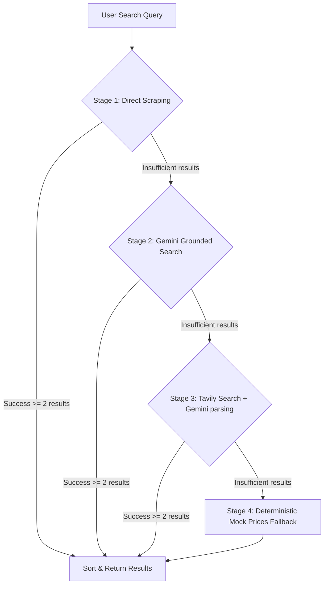

# 🤖 AI Visual Price Comparison Assistant - Backend API

An intelligent, production-ready FastAPI backend designed to orchestrate product price comparisons across major Indian e-commerce platforms in real-time. It integrates Google Gemini 2.5 Flash with search grounding, local HTML scrapers, and persistent SQLite search history logging to provide highly accurate, actionable price metrics and smart purchase recommendations.

---

## 🌟 Key Features

* **Multi-Stage Pricing Pipeline**:
  1. **Direct HTML Scraping (Stage 1)**: Utilizes `requests` and `BeautifulSoup4` with rotating User-Agents to scrape live prices and product links directly from **Amazon.in** and **Flipkart.com**.
  2. **Gemini Search Grounding (Stage 2)**: Calls the new `google-genai` SDK with `gemini-2.5-flash` and Google Search Grounding enabled. This extracts real-time, outright purchase prices (in INR) across platforms like Croma, Reliance Digital, Vijay Sales, JioMart, etc.
  3. **Tavily Search API Fallback (Stage 3)**: Serves as a backup search tool to extract search results, passing them to Gemini for structured price and URL parsing.
  4. **Deterministic Mock Pricing (Stage 4)**: A robust fallback system that generates stable, realistic product-specific prices if all live APIs rate-limit or fail, ensuring seamless demo performance.
* **Intelligent Recommendations**: Compares minimum and maximum listings, computes savings, and passes the structured dataset to Gemini to generate natural-language purchase advice.
* **Persistent Search History**: Connects to a local SQLite database (`history.db`) to record all user queries, parsed product names, search types, timestamps, and serialized JSON results.
* **Product Vision Helper**: Embedded utility leveraging Gemini Vision models to automatically extract model names and specifications from product screenshots/images.

---

## 🛠️ Technology Stack

* **Core Framework**: [FastAPI](https://fastapi.tiangolo.com/) - High-performance web API framework for Python.
* **ASGI Server**: [Uvicorn](https://www.uvicorn.org/) - Light and fast web server implementation.
* **Data Validation**: [Pydantic v2](https://docs.pydantic.dev/latest/) - Strict typing, parsing, and JSON serialization.
* **Generative AI**: [Google GenAI SDK](https://github.com/google/generative-ai-python) - Google's official client SDK for interacting with Gemini.
* **Web Scraping**: [BeautifulSoup4](https://www.crummy.com/software/BeautifulSoup/bs4/doc/) & [Requests](https://requests.readthedocs.io/) - HTML parser and HTTP client.
* **Database**: [SQLite](https://sqlite.org/index.html) - Zero-configuration, serverless SQL database engine.

---

## 📂 Directory Structure

```filepath
backend/
├── database/
│   ├── db.py               # SQLite connection pools, schema initialization, and query history helpers
│   └── history.db          # Auto-generated SQLite database file (ignored in version control)
├── models/
│   └── schemas.py          # Pydantic models for API request validation and response models
├── routes/
│   └── search.py           # FastAPI endpoints for search actions and history CRUD management
├── services/
│   ├── ai_service.py       # Google GenAI client, Gemini Vision parsing, Grounded searches, and recommendations
│   ├── price_service.py    # Pipeline coordinator orchestrating direct scraping, grounding, and mock fallbacks
│   └── search_engine.py    # Advanced search processing, Tavily API integration, price verification/scoring
├── .env                    # Local environment variables containing API keys (ignored)
├── main.py                 # Application entrypoint, logging setup, SQLite creation, and CORS policies
└── requirements.txt        # Backend dependencies and libraries list
```

---

## ⚙️ Configuration & Environment Variables

Copy or create a `.env` file in the root of the `backend/` folder:

```bash
# Path: backend/.env
GEMINI_API_KEY="your-google-gemini-api-key-here"
TAVILY_API_KEY="your-optional-tavily-api-key-here"
```

> [!IMPORTANT]
> A valid `GEMINI_API_KEY` is required for **Stage 2 (Gemini Search Grounding)**, product identification from images, and natural-language recommendation summarization. If not provided, the server falls back to mock recommendations and deterministic prices.

---

## 🚀 Installation & Running Locally

### 1. Set Up a Virtual Environment
Navigate to the root directory and activate the python virtual environment:
```powershell
# Create venv if not already present
python -m venv venv

# Activate on Windows (PowerShell)
.\venv\Scripts\Activate.ps1

# Activate on Linux/macOS
source venv/bin/activate
```

### 2. Install Dependencies
Change directory to the `backend/` folder and install requirements:
```bash
cd backend
pip install -r requirements.txt
```

### 3. Run the Development Server
Launch the application with live reload enabled:
```bash
python main.py
```
* Or run directly via Uvicorn:
```bash
uvicorn backend.main:app --host 0.0.0.0 --port 8000 --reload
```
Once started, the server is available at **`http://localhost:8000`**.

---

## 📖 API Documentation & Endpoints

FastAPI generates interactive documentation automatically. With the server running, visit:
* **Swagger UI**: [http://localhost:8000/docs](http://localhost:8000/docs)
* **ReDoc**: [http://localhost:8000/redoc](http://localhost:8000/redoc)

### Endpoint Summary

| Method | Endpoint | Description | Request Body / Params |
| :--- | :--- | :--- | :--- |
| **GET** | `/api/health` | Service health status | None |
| **POST** | `/api/search-text` | Search products & compare prices | `{"query": "Product Name"}` |
| **GET** | `/api/history` | Fetch search history | None |
| **DELETE** | `/api/history/{item_id}`| Delete a single history item | `item_id` (Path variable) |
| **DELETE** | `/api/history` | Clear all search history | None |

---

## 🔍 Code Walkthrough: Pipeline Stages



1. **Scraping Helper (`price_service.py`)**: Locates the product dynamically on Amazon/Flipkart using class patterns, extracts prices, and generates direct URL pointers.
2. **Search Grounding (`ai_service.py`)**: Instructs Gemini to search using the `google_search` tool. Returns a structured JSON list of Indian pricing matches.
3. **Price Validation (`search_engine.py`)**: Validates prices against model keywords to verify they do not capture accessory prices (e.g. phone chargers/cases instead of the device).
